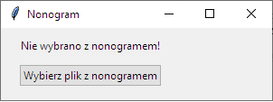
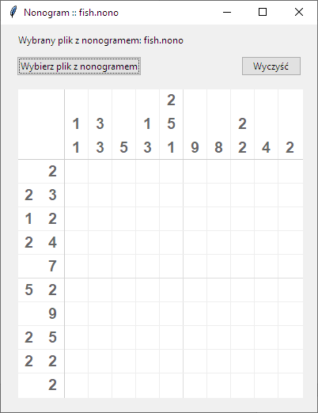
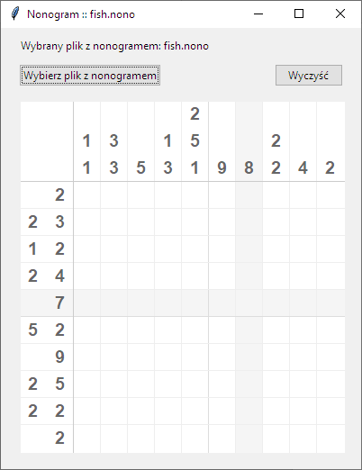
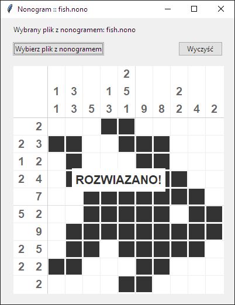

# Nonogram
Nonogram w Pythonie. Program używa biblioteki `Tkinter`.

## Uruchomienie
1) Skopiuj repozytorium
2) Uruchom aplikację
```
py nonogra.py
```

## Działanie aplikacji
Po uruchomieniu aplikacji należy wybrać plik z nonogramem poprzez okienko dialogowe uruchamiane przyciskiem `Wybierz plik z nonogramem`.



Po wybraniu nonogramu zostanie wygenerowany pusty diagram.



Klikając w pola diagramu będą on kolorowane na czarno, ponadto podświetlana jest koluman oraz wiersz nad którym znajduje się kursor myszy.



Po prawidłowym wypełniniu diagramu zostanie wyświetlony komunikat o treśći `ROZWIĄZANO!`.



W każdej chwili można wybrać nowy nonogram przyciskiem `Wybierz plik z nonogramem` lub wyczyścić diagram przyciskiem `Wyczyść`.

## Pliki z noogramami
Pliki z nonogramami znajdują się w katalogu `nonograms`. Posiadają rozszerzenie `*.nono`.\
W pliku z nonogramem znajdują się w kolejnych wierszach liczby całkowite oddzielone znakami pojedynczych spacji.\
W pierwszym wierszu znajdują się zwsze 2 liczby całkowite $N$ i $M$ określające kolejno ilość kolumn oraz ilość wierszy w nonogramie.\
W kolejnych $N$ wierszach znajdują się grupy liczb całkowitych dla kolejnych kolumn nonogramu, a kolejne $M$ wierszy określa grupy liczb całkowitych dla kolejnych wierszy nonogramu.


Grupy liczb w każdtym $N$-tym wierszu czytane od lewej do prawej umieszczane są nad diagramem od góry do dołu, a liczby w każdym $M$-tym wierszu umieszczane są po lewej stronie diagramu od lewej storny.


